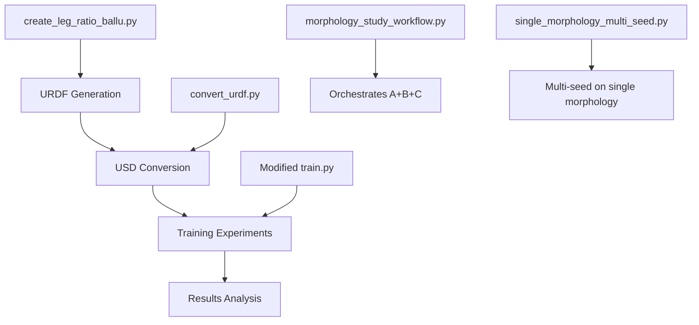

# BALLU Morphology Study Workflows

This directory contains automated workflows for conducting comprehensive morphology optimization studies on the BALLU (Buoyancy-Assisted Legged Locomotion Unit) robot. The system automates the complete pipeline from morphology generation to training and analysis.

## Overview

The morphology study system provides three levels of automation:

1. **Full Morphology Study** (`morphology_study_workflow.py`) - Compare multiple morphologies with fixed seed
2. **Single Morphology Multi-Seed** (`single_morphology_multi_seed.py`) - Statistical analysis of one morphology
3. **Individual Tools** - Manual control over each step

## System Architecture



## Prerequisites

- BALLU Isaac Lab Extension properly installed
- Original BALLU URDF file available
- Isaac Sim environment configured
- RSL-RL training pipeline working

## Core Scripts

### 1. Full Morphology Study Workflow

**Purpose**: Compare different morphologies (femur:tibia ratios) using the same random seed to isolate morphological effects.

**Script**: `morphology_study_workflow.py`

**Usage**:
```bash
# Basic morphology comparison
python morphology_study_workflow.py --ratios "1:1" "3:7" "1:2" --seed 42 --max_iterations 2000

# Advanced study with specific task
python morphology_study_workflow.py \
    --ratios "1:1" "1:2" "2:3" "3:7" "1:3" \
    --task Isaac-Vel-BALLU-imu-tibia \
    --seed 123 \
    --max_iterations 5000 \
    --num_envs 8192
```

**What it does**:
1. Generates URDF files for each specified ratio
2. Converts each URDF to USD format for Isaac Sim
3. Runs training experiments using the same seed across all morphologies
4. Saves comprehensive results and analysis

**Output Structure**:
```
morphology_studies/
└── morphology_study_20250129_143022/
    ├── morphology_study_results.json    # Complete results
    └── logs/                           # Training logs per morphology
```

### 2. Single Morphology Multi-Seed

**Purpose**: Statistical analysis of a single morphology across multiple random seeds to assess training variability and robustness.

**Script**: `single_morphology_multi_seed.py`

**Usage**:
```bash
# Multi-seed statistical analysis
python single_morphology_multi_seed.py --ratio "3:7" --seeds 42 123 456 789 999 --max_iterations 2000

# Focused study on specific morphology
python single_morphology_multi_seed.py \
    --ratio "1:1" \
    --seeds 1 2 3 4 5 6 7 8 9 10 \
    --task Isaac-Vel-BALLU-imu-tibia \
    --max_iterations 3000
```

**What it does**:
1. Generates a single morphology (URDF → USD)
2. Runs multiple training experiments with different seeds
3. Provides statistical analysis of performance variability

**Output Structure**:
```
morphology_studies/
└── single_morphology_FT_37_20250129_143022/
    ├── multi_seed_results.json         # Statistical results
    └── logs/                          # Training logs per seed
```

## Individual Component Scripts

### 3. URDF Generation

**Script**: `create_leg_ratio_ballu.py`

**Purpose**: Generate URDF files with custom femur-to-tibia ratios while preserving total leg length.

**Usage**:
```bash
# Generate 3:7 ratio URDF
python create_leg_ratio_ballu.py --ratio 3:7 --output modified_ballu_3_7.urdf

# Generate using separate ratio values
python create_leg_ratio_ballu.py --femur-ratio 1 --tibia-ratio 2 --output modified_ballu_1_2.urdf
```

**Features**:
- Maintains total leg length (preserves robot scale)
- Updates physics properties (mass, inertia, center of mass)
- Adjusts joint positions and collision geometry
- Scales visual meshes appropriately

### 4. USD Conversion

**Script**: `convert_urdf.py`

**Purpose**: Convert URDF files to USD format for Isaac Sim simulation.

**Usage**:
```bash
# Convert URDF to USD
python convert_urdf.py input.urdf output.usd --headless

# With custom joint settings
python convert_urdf.py input.urdf output.usd \
    --joint-stiffness 50.0 \
    --joint-damping 2.0 \
    --fix-base
```

## Configuration and Setup

### Environment Variables

The system uses environment variables for robot asset override:

- `BALLU_MORPHOLOGY_USD_PATH`: Override default robot USD path

This is automatically set by the workflow scripts but can be manually controlled:

```bash
export BALLU_MORPHOLOGY_USD_PATH="/path/to/custom/morphology.usd"
python scripts/rsl_rl/train.py --task Isc-Vel-BALLU-encoder --seed 42
```

### Robot Configuration

The robot configuration in `ballu_config.py` has been enhanced to support morphology override:

```python
def get_robot_usd_path():
    """Get robot USD path, with support for morphology override."""
    morphology_usd_path = os.environ.get('BALLU_MORPHOLOGY_USD_PATH')
    if morphology_usd_path and os.path.exists(morphology_usd_path):
        return morphology_usd_path
    else:
        return os.path.join(root_usd_path, "original", "original.usd")
```

## File Organization

### Generated Assets Structure

```
BALLU_IsaacLab_Extension/
├── source/ballu_isaac_extension/ballu_isaac_extension/ballu_assets/
│   └── robots/
│       ├── original/                  # Default robot
│       ├── FT_11/                    # 1:1 ratio morphology
│       │   ├── ballu_modified_FT_11.urdf
│       │   └── ballu_modified_FT_11.usd
│       ├── FT_37/                    # 3:7 ratio morphology
│       │   ├── ballu_modified_FT_37.urdf
│       │   └── ballu_modified_FT_37.usd
│       └── ...
├── morphology_studies/               # Experiment results
│   ├── morphology_study_20250129_143022/
│   ├── single_morphology_FT_37_20250129_150000/
│   └── ...
└── scripts/morphology_utils/
    ├── morphology_study_workflow.py
    ├── single_morphology_multi_seed.py
    ├── create_leg_ratio_ballu.py
    ├── convert_urdf.py
    └── README_morphology_workflows.md
```

## Experiment Design Guidelines

### 1. Morphology Comparison Study

**Goal**: Determine optimal femur-to-tibia ratio

**Design**:
```bash
python morphology_study_workflow.py \
    --ratios "1:3" "1:2" "2:3" "1:1" "3:2" "2:1" "3:1" \
    --seed 42 \
    --max_iterations 3000 \
    --task Isc-Vel-BALLU-encoder
```

**Analysis Focus**:
- Final performance comparison
- Training convergence rates  
- Stability metrics

### 2. Statistical Robustness Study

**Goal**: Assess training variability for promising morphology

**Design**:
```bash
python single_morphology_multi_seed.py \
    --ratio "3:7" \
    --seeds 1 2 3 4 5 6 7 8 9 10 \
    --max_iterations 5000 \
    --task Isc-Vel-BALLU-encoder
```

**Analysis Focus**:
- Performance distribution
- Convergence reliability
- Outlier detection

### 3. Task-Specific Optimization

**Goal**: Find optimal morphology for specific tasks

**Design**:
```bash
# For each task, run morphology comparison
for task in "Isc-Vel-BALLU-encoder" "Isaac-Vel-BALLU-imu-tibia" "Isaac-Vel-BALLU-imu-base"
do
    python morphology_study_workflow.py \
        --ratios "1:2" "1:1" "3:7" "2:1" \
        --task $task \
        --seed 42 \
        --max_iterations 3000
done
```

## Results Analysis

### JSON Output Structure

**Morphology Study Results** (`morphology_study_results.json`):
```json
{
  "study_id": "morphology_study_20250129_143022",
  "task": "Isc-Vel-BALLU-encoder",
  "seed": 42,
  "morphologies": [
    {
      "ratio_str": "3:7",
      "ratio_name": "FT_37",
      "usd_path": "/path/to/ballu_modified_FT_37.usd",
      "status": "generated"
    }
  ],
  "experiments": [
    {
      "experiment_id": "FT_37_seed_42",
      "ratio_name": "FT_37",
      "status": "completed",
      "duration_minutes": 45.2
    }
  ]
}
```

**Multi-Seed Results** (`multi_seed_results.json`):
```json
{
  "experiment_id": "single_morphology_FT_37_20250129_143022",
  "ratio": "3:7",
  "seeds": [42, 123, 456, 789, 999],
  "morphology": { "status": "generated", "usd_path": "..." },
  "experiments": [
    {
      "experiment_id": "FT_37_seed_42",
      "seed": 42,
      "status": "completed",
      "duration_minutes": 43.1
    }
  ]
}
```

### Training Logs Integration

The system integrates with the existing `multi_run_training.py` analysis:
- TensorBoard metrics extraction
- Training convergence curves
- Comprehensive performance statistics
- Loss evolution tracking

## Advanced Usage

### Custom Morphology Ranges

For comprehensive studies, you can generate systematic ratio ranges:

```python
# Generate ratios from 1:3 to 3:1 in steps
ratios = []
for f in range(1, 4):  # femur: 1, 2, 3
    for t in range(1, 4):  # tibia: 1, 2, 3
        ratios.append(f"{f}:{t}")

# Run: python morphology_study_workflow.py --ratios 1:1 1:2 1:3 2:1 2:2 2:3 3:1 3:2 3:3
```

### Parallel Processing

For large studies, you can run experiments in parallel by modifying the workflow or running multiple instances:

```bash
# Terminal 1: Run ratios 1-3
python morphology_study_workflow.py --ratios "1:1" "1:2" "1:3" --seed 42

# Terminal 2: Run ratios 4-6  
python morphology_study_workflow.py --ratios "2:1" "2:2" "2:3" --seed 42

# Terminal 3: Run ratios 7-9
python morphology_study_workflow.py --ratios "3:1" "3:2" "3:3" --seed 42
```

### Integration with Existing Scripts

The morphology system is compatible with existing BALLU training scripts:

```bash
# Use existing multi_run_training.py with morphology override
export BALLU_MORPHOLOGY_USD_PATH="/path/to/FT_37/ballu_modified_FT_37.usd"
python scripts/rsl_rl/multi_run_training.py \
    --task Isc-Vel-BALLU-encoder \
    --seeds 42 123 456 \
    --max_iterations 2000
```

## Troubleshooting

### Common Issues

1. **URDF Generation Fails**
   - Check original URDF path exists
   - Verify write permissions in output directory
   - Ensure valid ratio values (positive numbers)

2. **USD Conversion Fails**
   - Verify Isaac Sim environment is properly configured
   - Check URDF file is valid and readable
   - Ensure sufficient disk space

3. **Training Experiments Fail**
   - Verify task name is valid and registered
   - Check robot USD file exists and is readable
   - Monitor GPU memory usage

4. **Environment Variable Not Working**
   - Ensure `BALLU_MORPHOLOGY_USD_PATH` points to existing file
   - Check file permissions
   - Verify `ballu_config.py` has been updated with override function

### Debug Mode

For debugging, you can run individual components:

```bash
# Test URDF generation only
python create_leg_ratio_ballu.py --ratio 3:7 --output test_3_7.urdf

# Test USD conversion only  
python convert_urdf.py test_3_7.urdf test_3_7.usd --headless

# Test training with specific USD
export BALLU_MORPHOLOGY_USD_PATH="$(pwd)/test_3_7.usd"
python scripts/rsl_rl/train.py --task Isc-Vel-BALLU-encoder --seed 42 --max_iterations 100
```

## Example Workflows

### Quick Morphology Screening

```bash
# Fast screening of 4 morphologies (short training)
python morphology_study_workflow.py \
    --ratios "1:2" "1:1" "2:1" "3:7" \
    --seed 42 \
    --max_iterations 1000 \
    --num_envs 2048
```

### Comprehensive Study

```bash
# Full study with statistical validation
# Step 1: Screen morphologies
python morphology_study_workflow.py \
    --ratios "1:3" "1:2" "2:3" "1:1" "3:2" "2:1" "3:1" \
    --seed 42 \
    --max_iterations 3000

# Step 2: Validate best performing morphology (e.g., 3:7)
python single_morphology_multi_seed.py \
    --ratio "3:7" \
    --seeds 1 2 3 4 5 6 7 8 9 10 \
    --max_iterations 5000
```

This morphology workflow system provides a comprehensive, automated approach to morphology optimization for the BALLU robot, enabling systematic and reproducible research into the relationship between robot morphology and locomotion performance. 